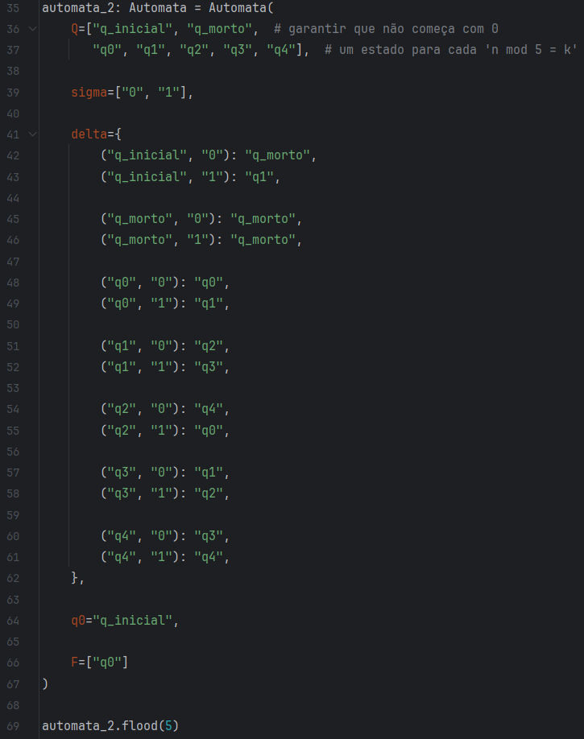
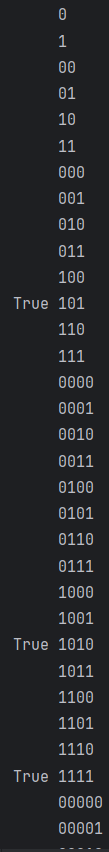

# automata

Python implementation of automata for test purposes

## Demo

Considere o AFD que aceite a linguagem de todos os strings que começam com 1 e que quando interpretados como um inteiro binário é um múltiplo de 5.

### Inicialização do autômato

### Resultado dos testes

